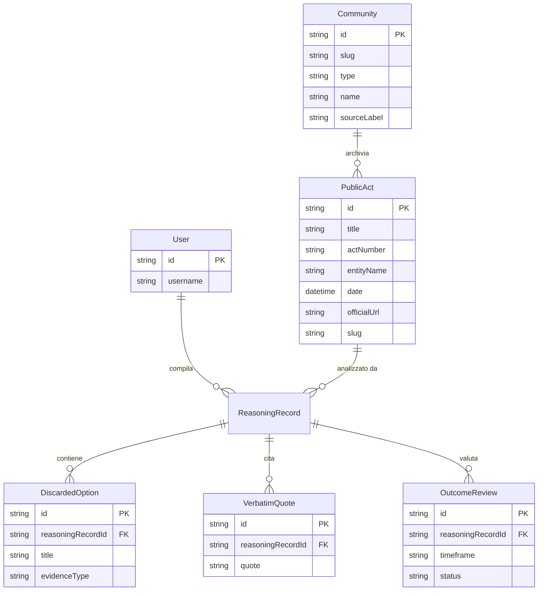

# Architecture & System Design — Dubitor

> **"Le decisioni dicono *cosa* si è scelto. Dubitor conserva e verifica *perché*."**

Questo documento dettaglia l'architettura tecnica, le scelte di design dei dati e il flusso dei componenti della piattaforma **Dubitor**.

---

## 1. Principi Architetturali

1. **Community configurabile, metodo fisso**:
   - Il feed è uno. Una *community* è un luogo di giudizio (comune, ufficio, progetto).
   - Il pack (nome, categorie, come si chiama la fonte) è configurazione. Lo schema a sei elementi non lo è.

2. **Separazione Rigida delle Fonti**:
   - **Verbatim**: citazioni esatte dalla fonte (delibera, verbale, deck).
   - **Interpretazione**: ricostruzione della domanda reale, delle opzioni scartate e delle assunzioni.

3. **Falsificabilità**:
   - Ogni scheda (*ReasoningRecord*) richiede una o più **Condizioni di Falsificabilità**: criteri misurabili a priori che avrebbero fatto o faranno cambiare idea.

4. **Ciclo di Verifica a Posteriori (Outcome Reviews)**:
   - Valutazione degli impatti reali a 6, 12 o 24 mesi.

5. **Reddit-Style Feed**:
   - Card, filtri per incertezza e verifiche, selettore community in navbar (`?c=`). Mock: Cormano, Ufficio People, Progetto Capex 2027.

---

## 2. Stack Tecnologico

- **Framework Web**: Next.js 14 (App Router con Server & Client Components)
- **Linguaggio**: TypeScript (Strict Mode)
- **Styling**: Tailwind CSS (Custom design system in `globals.css` per card stile Reddit, badge di stato e typography)
- **Database & ORM**: Prisma + **PostgreSQL** — Auth.js (User/Account/Session) e overlay Editor (`CuratorStoreState` → tabella `curator_store`, JSON). I Reasoning Record demo restano in `lib/` come seed di lettura, con override applicati dall’overlay.
- **Autenticazione**: NextAuth.js v5 (Auth.js) con Prisma Adapter e Google OAuth
- **Grafo**: @xyflow/react per la board decisionale sulla scheda

---

## 3. Modello Dati Relazionale (Prisma Schema)

Oggi il pack `Community` vive in [`lib/communities.ts`](../lib/communities.ts) (mock). Lo schema Prisma resta centrato su `PublicAct`; allinearlo al tipo `Community` è un passo successivo, quando serve persistenza.

---

## 4. Struttura dei Moduli nel Repository

- `app/`: Next.js App Router (feed `/`, fonti `/acts`, schede `/records/new`, autenticazione `/auth`).
- `components/`: UI (Navbar con selettore community, Sidebar, card, matrice verbatim).
- `lib/communities.ts`: pack delle community; `hooks/useActiveCommunity.ts` legge `?c=`.
- `prisma/`: schemi database (non ancora allineati al pack Community).
- `types/`: dominio TypeScript (`Community`, `ReasoningRecord`).
- `docs/`: documentazione tecnica e operativa.
