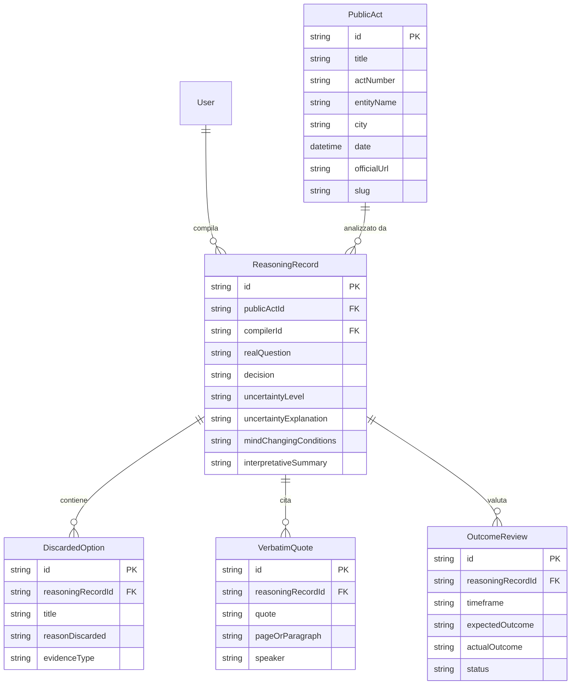

# Architecture & System Design — Reasoning Records

> **"Le delibere dicono *cosa* si è deciso. Reasoning Records conserva e verifica *perché* si è deciso."**

Questo documento dettaglia l'architettura tecnica, le scelte di design dei dati e il flusso dei componenti della piattaforma **Reasoning Records**.

---

## 1. Principi Architetturali

1. **Separazione Rigida delle Fonti**:
   - **Verbatim (Fonte Ufficiale)**: Quotazioni esatte estratte dal testo grezzo dell'atto pubblico (es. delibere comunali, determine).
   - **Interpretazione (Analisi del Curatore)**: Ricostruzione sintetica della domanda reale, delle opzioni scartate e delle assunzioni.

2. **Falsificabilità delle Decisioni Amministrative**:
   - Ogni scheda (*ReasoningRecord*) richiede una o più **Condizioni di Falsificabilità**: criteri misurabili a priori che avrebbero fatto o faranno cambiare idea al decisore.

3. **Ciclo di Verifica a Posteriori (Outcome Reviews)**:
   - Valutazione degli impatti reali a distanza di 6, 12 o 24 mesi per confrontare i risultati previsti con quelli registrati sul campo.

4. **Reddit-Style Feed & Territoriali**:
   - Struttura basata sulla consultazione snella a card, filtri rapidi per livello di incertezza e presenza di verifiche completate, contestualizzata su ambiti locali (es. Comune di Cormano - MI).

---

## 2. Stack Tecnologico

- **Framework Web**: Next.js 14 (App Router con Server & Client Components)
- **Linguaggio**: TypeScript (Strict Mode)
- **Styling**: Tailwind CSS (Custom design system in `globals.css` per card stile Reddit, badge di stato e typography)
- **Database & ORM**: Prisma ORM con supporto multi-provider (SQLite `dev.db` per sviluppo, PostgreSQL per produzione)
- **Autenticazione**: NextAuth.js v5 (Auth.js) integrato con Prisma Adapter e Google OAuth Provider

---

## 3. Modello Dati Relazionale (Prisma Schema)

---

## 4. Struttura dei Moduli nel Repository

- `app/`: Next.js App Router (Pagine per feed principale, dettagli atti `/acts/[slug]`, schede `/records/[id]`, e autenticazione `/auth`).
- `components/`: Componenti UI focalizzati (es. `ReasoningRecordCard.tsx`, `VerbatimVsInterpretationViewer.tsx`, `Sidebar.tsx`).
- `prisma/`: Schemi e definizioni del database.
- `types/`: Definizioni dei tipi TypeScript del dominio.
- `lib/`: Utilities e mock data di sviluppo.
- `docs/`: Documentazione tecnica e operativa.
