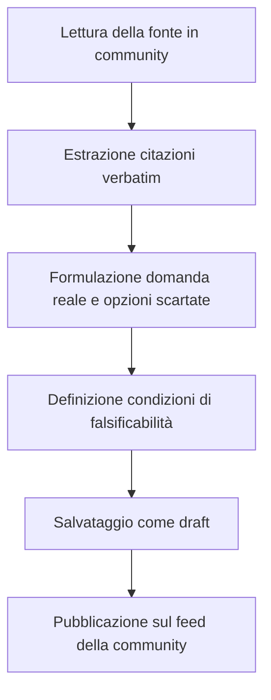

# Guida operativa per chi compila le schede

> **Reasoning Records** — Memoria del giudizio (community configurabile)

Questa guida definisce lo standard metodologico per chi compila e revisiona le schede di giudizio (**Reasoning Records**) a partire da una fonte: delibera, verbale, deck, nota di seduta. Il luogo (comune, ufficio, progetto) è configurazione. Il metodo no.

---

## 1. Principi metodologici

### 1.1 Neutralità
Le schede **non esprimono opinioni di parte**. L'obiettivo è ricostruire la **struttura logica e le assunzioni del decisore**, affinché la scelta sia trasparente e falsificabile.

### 1.2 Rigida separazione delle fonti (verbatim vs interpretazione)
- **Fonte (verbatim)**: va riportata fedelmente tra virgolette, con paragrafo o pagina.
- **Ricostruzione (interpretazione)**: va sempre marcata come sintesi analitica, non come voce del decisore.

---

## 2. Struttura di una scheda di giudizio

Ogni record completo si compone di 6 elementi. Restano gli stessi in ambito civico e aziendale.

### 1. La domanda reale (*Real Question*)
Traduzione dal linguaggio di circostanza al problema sostanziale.
- *Fonte*: "Approvazione delibera n. 28 in ordine alla viabilità di quartiere."
- *Domanda reale*: "Come fluidificare il traffico senza eliminare i parcheggi per i residenti?"
- *In azienda*: il titolo del deck è "Piano capex 2027"; la domanda reale può essere "crescere di scala o proteggere il sito storico?"

### 2. Le opzioni scartate (*Discarded Options*)
Per ciascuna alternativa:
- **Titolo**
- **Motivo dello scarto**
- **Tipo di evidenza** (*verbatim* se nella fonte, *interpretation* se desunta)

### 3. La decisione presa (*Decision*)
Sintesi chiara, senza tecnicismi di circostanza.

### 4. Livello di incertezza e assunzioni
- **Basso**: dati storici o prassi collaudate.
- **Medio**: variabili di contesto (traffico, mercato, adesione).
- **Alto**: scelta non sperimentata o identitaria.

### 5. Condizioni di falsificabilità (*Mind-Changing Conditions*)
**Il requisito più importante.** *Cosa farebbe cambiare idea a chi ha deciso?*
Esempi:
- Tempi di attesa oltre +5 minuti nei primi 3 mesi.
- Saturazione impianti sopra l’85% per due trimestri.

Senza questo campo la scheda non è un reasoning record: è un comunicato.

### 6. Ciclo di verifica a posteriori (*Outcome Reviews*)
A 6, 12 o 24 mesi: `pending`, `verified_true`, `verified_false`.

---

## 3. Workflow

La community (comune / ufficio / progetto) cambia etichette e categorie. Non cambia i sei elementi.

---

## 4. Dove si modifica cosa (oggi)

Il prototipo usa **dati mock in codice**. Non c’è ancora un pannello admin nel browser: si edita nei file sotto e si riavvia il dev server.

### Community (nome, copy, categorie, logo)

| Cosa | File |
|------|------|
| Nome, slug, tagline, categorie, stats, etichette fonti | `lib/communities.ts` |
| Logo e banner sidebar | `public/communities/{slug}/logo.svg` e `cover.svg` — vedi `public/communities/README.md` |
| Nuova community | Aggiungi un oggetto in `communities[]` in `lib/communities.ts` + cartella immagini + corpus record |

### Decisioni e schede

| Cosa | File |
|------|------|
| Record Cormano / Moretti / Capex | `lib/data.ts` |
| Record Weltform (corpus separato) | `lib/weltform.ts` |
| Atti / fonti collegati | Stesso file del corpus (`publicAct` + `reasoningRecord`) |
| Form nuova scheda (UI) | `/records/new` — oggi non persiste su DB |

### Aggiungere una decisione

1. Crea un `PublicAct` (titolo, estratto, data, slug).
2. Crea un `ReasoningRecord` con i 6 elementi e `publicActId` corrispondente.
3. Assicurati che `entity.id` / `community.id` del record coincida con la community in `lib/communities.ts`.
4. Per Weltform: append in `weltformActs` e `weltformRecords` in `lib/weltform.ts` (già importati da `lib/data.ts`).

### Editor in-app

Accedi con Google, poi apri **Editor** nella navbar (o `/curator?c=slug`).

| Azione | Dove |
|--------|------|
| Modificare nome, tagline, categorie, logo e banner | Editor → Community (upload o URL) |
| Modificare una scheda esistente | Editor → Schede → scheda |
| Nuova scheda | Nuovo Record (navbar) o Editor |
| Persistenza | `data/curator-store.json` (override sul mock di base) |

I contenuti demo in `lib/data.ts` e `lib/weltform.ts` restano la base; l’editor salva solo le differenze e le aggiunte.
