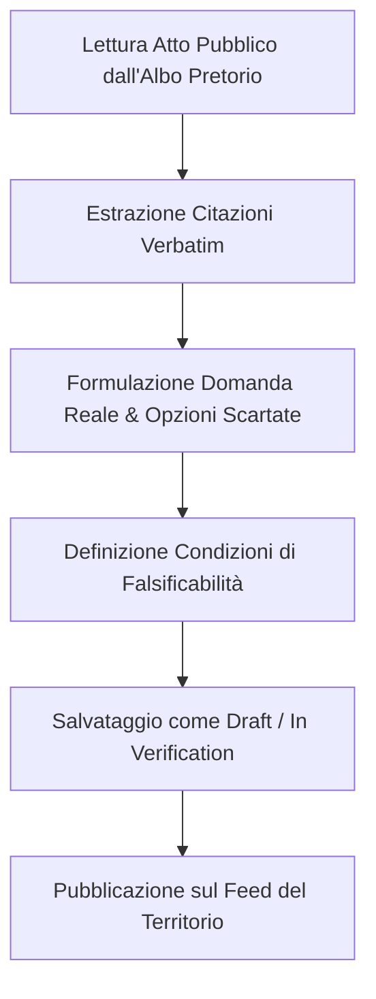

# Guida Operativa per Curatori e Analisti Civici

> **Reasoning Records** — Trasparenza del Giudizio Amministrativo

Questa guida definisce lo standard metodologico e operativo per i curatori, gli analisti e i cittadini che compilano e revisionano le schede di giudizio (**Reasoning Records**) a partire dagli atti pubblici (delibere comunali, determinazioni dirigenziali, verbali di consiglio).

---

## 1. Principi Metodologici Fondamentali

### 1.1 Neutralità e Obiettività Amministrativa
Le schede di Reasoning Records **non esprimono opinioni politiche o giudizi di parte**. L'obiettivo è ricostruire con la massima precisione la **struttura logica e le assunzioni del decisore**, affinché la scelta sia trasparente e falsificabile.

### 1.2 Rigida Separazione delle Fonti (Verbatim vs Interpretazione)
- **Fonte Ufficiale (Verbatim)**: Va riportata fedelmente tra virgolette, con indicazione del paragrafo o della pagina precisa dell'atto.
- **Ricostruzione (Interpretazione del Curatore)**: Va sempre marcata esplicitamente come sintesi analitica o deduzione logica basata sugli elementi del verbale.

---

## 2. Struttura di una Scheda di Giudizio

Ogni record completo si compone dei seguenti 6 elementi essenziali:

### 1. La Domanda Reale (*Real Question*)
Traduzione dal linguaggio burocratico al reale problema amministrativo/sociale.
- *Burocratico*: "Approvazione delibera n. 28 ex art. 42 D.Lgs 267/2000 in ordine alla viabilità di quartiere."
- *Domanda Reale*: "Come fluidificare il traffico ed evitare code sulla arteria principale senza eliminare i parcheggi per i residenti del quartiere?"

### 2. Le Opzioni Scartate (*Discarded Options*)
Ogni decisione implica la scelta di un'alternativa a scapito di altre.
Per ciascuna opzione scartata va specificato:
- **Titolo dell'alternativa** (es. *Rotonda all'incrocio X*).
- **Motivo dello scarto** (es. *Spazio insufficiente per raggio di curvatura dei bus*).
- **Tipo di evidenza** (*verbatim* se menzionato nell'atto, *interpretation* se desunto dagli atti di commissione).

### 3. La Decisione Presa (*Decision*)
Sintesi chiara e priva di tecnicismi dell'azione amministrativa disposta dall'atto.

### 4. Livello di Incertezza e Assunzioni (*Uncertainty Level & Explanation*)
Classificazione del rischio o incertezza dichiarata o implicita:
- **Basso**: Scelte basate su dati storici certi o prassi collaudate.
- **Medio**: Dipendente da variabili di traffico, condizioni di mercato o adesione dell'utenza.
- **Alto**: Progetti complessi di rigenerazione, bonifica o innovazione non sperimentata.

### 5. Condizioni di Falsificabilità (*Mind-Changing Conditions*)
**Il requisito più importante**. Risponde alla domanda: *Cosa farebbe cambiare idea a chi ha deciso?*
Esempi:
- *Aumento dei tempi di percorrenza d'attesa oltre +5 minuti nei primi 3 mesi.*
- *Mancato rispetto dei costi di bonifica concordati entro 12 mesi.*

### 6. Ciclo di Verifica a Posteriori (*Outcome Reviews*)
Monitoraggio previsto a 6, 12 o 24 mesi:
- **Stato**: `pending` (in corso), `verified_true` (esito confermato), `verified_false` (esito smentito).

---

## 3. Workflow di Pubblicazione

