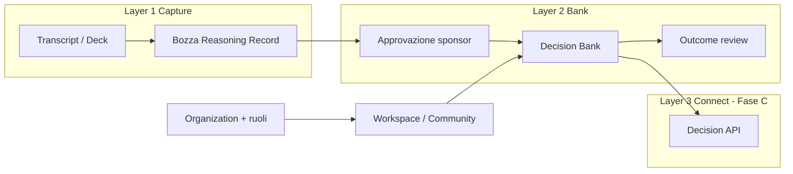

# Piano di evoluzione — Reason → Decision OS

> **North star:** da feed pubblico di schede di giudizio a **Decision Bank privata** con cattura da fonte (transcript/deck), approvazione rapida e pack compliance EU — mantenendo il kernel Reasoning Record a sei elementi.

**Orizzonte:** 3 fasi (A demo · B vendibile · C platform)  
**Principio:** evolvere il repo attuale, non riscriverlo.

---

## 1. Stato attuale (baseline)

### Già allineato con Decision OS

| Asset | Dove |
|-------|------|
| Schema Reasoning Record (6 elementi + review) | `types/index.ts` |
| Verbatim vs interpretazione | `components/VerbatimVsInterpretationViewer.tsx` |
| Tracciamento IA in compilazione | `types/index.ts`, `components/AiAssistance*` |
| Community = workspace configurabile | `lib/communities.ts`, `hooks/useActiveCommunity.ts` |
| Editor + persistenza override | `app/curator/*`, `lib/curator/*`, Postgres `curator_store` |
| API creazione record | `app/api/curator/records/route.ts` |
| Auth Google + sessione | `auth.ts`, `middleware.ts` |
| Corpus demo civic + enterprise | `lib/data.ts`, `lib/weltform.ts` |

### Gap verso unicorn path

| Gap | Impatto |
|-----|---------|
| Entry point = form vuoto | Adozione zero (homework) |
| Feed pubblico + upvote default | UX sbagliata per enterprise |
| Nessun `visibility` / org / ruoli | Non vendibile B2B |
| Prisma non allineato a Community | Persistenza reale bloccata |
| Nessun ingest transcript | Layer Capture assente |
| Nessun pack compliance in UI | Buyer sbagliato (curiosi, non Legal/Risk) |

---

## 2. Architettura target (semplificata)



**Regola prodotto:** Fase A–B = Capture + Bank. Fase C = API (solo con piloti paganti e >50k decisioni).

---

## 3. Fase A — Demo Decision OS (2–4 settimane)

**Obiettivo:** pitch e design partner. Zero refactor Prisma profondo.

### A1 — Nuovo flusso principale: Capture → Approva

| Task | File / azione |
|------|----------------|
| Nuova route `/records/capture` | `app/records/capture/page.tsx` |
| Step 1: incolla transcript o testo fonte | textarea + optional titolo fonte |
| Step 2: genera bozza (v1 rule-based o LLM behind env) | `lib/capture/draft-from-source.ts` |
| Step 3: review campi (domanda, decisione, 1 scarto, kill criteria) | riusa campi da `app/records/new/page.tsx` |
| Step 4: salva come `draft`, redirect a record | POST esistente `/api/curator/records` |
| Navbar: CTA primaria → Capture, secondaria → form manuale | `components/Navbar.tsx` |
| Deprecare visivamente “Pubblica” → “Chiudi decisione” | copy in form e capture |

**Acceptance:** da transcript demo → scheda draft in <3 minuti senza inventare testi a mano.

### A2 — Visibilità e modalità workspace

| Task | File / azione |
|------|----------------|
| Aggiungere `visibility: 'private' \| 'public'` a `ReasoningRecord` | `types/index.ts` |
| Default `private` se `community.type` ∈ `ufficio`, `progetto`, `azienda` | `lib/curator/serialize.ts`, POST records |
| Default `public` se `comune` (lab civico) | idem |
| Feed: filtrare record private per utenti non auth (nascondere o blur) | `app/page.tsx`, `contexts/CuratorDataContext.tsx` |
| Card: badge “Privato” / “Registro pubblico” | `components/ReasoningRecordCard.tsx` |

**Acceptance:** aprendo Capex 2027 da anonimo non si vedono draft privati.

### A3 — Community demo “AI Governance”

| Task | File / azione |
|------|----------------|
| Nuova community `ai-governance` | `lib/communities.ts` |
| 2–3 record demo (decisione AI HR, model risk, vendor LLM) | `lib/data.ts` o `data/curator-store.json` |
| Categorie: AI in prodotti, HR, Vendor, Audit | pack compliance |
| Copy orientata compliance (non filosofia) | tagline, feedSubtitle, placeholders |
| Logo/banner placeholder | `public/communities/ai-governance/` |

**Acceptance:** switch `?c=ai-governance` racconta prodotto enterprise in 30 secondi.

### A4 — Stati workflow (solo types + UI, no DB)

| Task | File / azione |
|------|----------------|
| Estendere status: `draft` \| `in_session` \| `pending_sponsor` \| `closed` \| `under_review` | `types/index.ts` |
| Mappare `published` legacy → `closed` in display | `components/ReasoningRecordCard.tsx` |
| Badge stato in card e editor | `app/curator/records/[id]/page.tsx` |

**Acceptance:** record catturato resta `draft` finché non “Chiuso dallo sponsor”.

### A5 — Documentazione e pitch

| Task | File / azione |
|------|----------------|
| One-pager interno “AI Governance Decision Log” | `docs/AI_GOVERNANCE_PACK.md` |
| Aggiornare README: dual mode public lab + private bank | `README.md` |
| Screenshot flow capture per deck | manuale |

**Acceptance:** materiale pronto per 10 outreach design partner.

### Fuori scope Fase A

- Integrazione Teams/Meet reale
- Multi-tenant Prisma
- White-label partner
- Decision API
- Rimuovere upvote (solo nascondere in workspace enterprise)

---

## 4. Fase B — Vendibile a studi e Mittelstand (6–10 settimane)

**Obiettivo:** primo retainer / pilota pagato. Persistenza DB allineata.

### B1 — Modello Organization

Persistenza overlay **in Postgres** (`curator_store` JSON). I record di dominio non sono ancora tabelle Prisma dedicate; il corpus demo resta in `lib/` + override.

| Task | Dettaglio |
|------|-----------|
| `Organization` + ruoli owner/admin/compiler/sponsor/viewer | `types/index.ts`, `lib/org/` |
| Roster in `curator_store` (campo `organization.members`) | `organization.members` |
| Roster vuota = ogni utente loggato è owner (demo) | `resolveMemberRole` |

### B2 — Allineamento PublicAct ↔ Community

| Task | Dettaglio |
|------|-----------|
| `PublicAct.communityId` al posto di campi Cormano hardcoded | schema + migrate |
| Rimuovere default `entityName`, `city` Cormano da Prisma | `prisma/schema.prisma` |
| Sync types TS ↔ Prisma | `types/index.ts` |

### B3 — RBAC e route

| Task | Dettaglio |
|------|-----------|
| Middleware: org context da session o subdomain futuro | `middleware.ts` |
| Solo `compiler+` crea/modifica record | `lib/curator/auth.server.ts` |
| `sponsor` può approvare/chiudere | nuova action API |
| `/curator` limitato a membri org | auth checks |

### B4 — UX enterprise

| Task | Dettaglio |
|------|-----------|
| Rimuovere upvote da community non-civic | `ReasoningRecordCard.tsx` + flag community |
| Rinominare in UI: “Community” → “Workspace” (enterprise) | `Navbar`, `Sidebar` |
| Vista “Decision Bank” (tabella + filtri) accanto al feed | `app/bank/page.tsx` |
| Export PDF/Markdown singola decisione | `app/api/records/[id]/export/route.ts` |

### B5 — Capture v2

| Task | Dettaglio |
|------|-----------|
| Upload file `.txt`, `.vtt`, `.docx` (testo) | capture page |
| Prompt template per LLM (domanda reale, scarti, falsificabilità) | `lib/capture/prompts.ts` |
| Log obbligatorio in `aiAssistance` | già in types |
| Rate limit + API key env | route server |

### B6 — Compliance pack (vendibile)

| Task | Dettaglio |
|------|-----------|
| Template record per AI Act use cases | seed + docs |
| Campo `compliancePack?: 'ai_governance' \| 'board' \| 'capex'` | types |
| Filtro feed per pack | `app/page.tsx` |

**Gate Fase B (go/no-go):**

- [x] Organization + ruoli su store (demo)
- [x] Decision Bank + export markdown
- [x] Capture da file testo
- [ ] 3 org pilot con dati reali (non mock)
- [ ] ≥70% bozze chiuse entro 48h
- [ ] 1 export usato in audit / board reale
- [ ] 1 rinnovo o secondo workspace

---

## 5. Fase C — Platform (dopo piloti paganti)

**Obiettivo:** narrativa Series A, leva API, partner B2B2B.

| Workstream | Deliverable |
|------------|-------------|
| Integrazioni | Teams / Meet webhook, calendar hook |
| Partner | White-label subdomain, rev share, partner admin |
| Sovereign EU | hosting EU, DPA template, retention policies |
| Decision API | read-only REST, API keys, conflict-check endpoint |
| GTM | landing separata, pricing page, SOC2 roadmap |

**Non iniziare Fase C** finché Fase B gate non è verde.

---

## 6. Mappa file per priorità (Fase A)

```
Priorità 1 (settimana 1)
├── app/records/capture/page.tsx          [NEW]
├── lib/capture/draft-from-source.ts      [NEW]
├── types/index.ts                        [visibility, status]
├── components/Navbar.tsx                 [CTA Capture]
└── lib/communities.ts                    [+ ai-governance]

Priorità 2 (settimana 2)
├── app/page.tsx                          [filter visibility]
├── components/ReasoningRecordCard.tsx    [badge, copy]
├── lib/curator/serialize.ts              [defaults visibility]
├── app/api/curator/records/route.ts      [accept new fields]
├── lib/data.ts                           [demo AI governance]
└── docs/AI_GOVERNANCE_PACK.md            [NEW]

Priorità 3 (settimana 3–4)
├── app/curator/records/[id]/page.tsx       [status workflow UI]
├── README.md                             [dual mode]
└── public/communities/ai-governance/     [assets]
```

---

## 7. Metriche

| Fase | Metrica | Target |
|------|---------|--------|
| A | Tempo transcript → draft | < 5 min |
| A | Design partner in pipeline | 10 contatti |
| B | Org pilot attive | 3 |
| B | Bozze chiuse / bozze create | > 70% |
| B | ARR o LOI | ≥ 1 pilota pagato |
| C | Partner B2B2B | 20+ |
| C | ARR | 8–20 M€ (Y2–4 modello) |

---

## 8. Rischi e mitigazioni

| Rischio | Mitigazione |
|---------|-------------|
| Scope creep (API, Teams, org tutto insieme) | Gate rigidi A → B → C |
| LLM cost / quality in capture | v1 rule-based + 1 prompt; LLM opt-in |
| Perdere identità civica | Cormano resta public lab; doc dual-mode |
| Prisma refactor blocca A | A usa solo curator-store + types |
| Copy ancora “Reddit” | enterprise workspace nasconde upvote |

---

## 9. Cosa non fare

1. **Rewrite** in nuovo repo  
2. **Rimuovere** kernel Reasoning Record o guida curatori  
3. **Aggiungere** CRM, wiki, chat generica  
4. **Self-serve** pubblico come GTM primario  
5. **Fase C** prima di 3 piloti chiusi  

---

## 10. Prossima azione immediata

Implementare **A1 + A3** in un unico PR:

1. `lib/capture/draft-from-source.ts` — parser minimalista (estratto → campi)  
2. `app/records/capture/page.tsx` — wizard 3 step  
3. Community `ai-governance` + 2 record demo  
4. Navbar → link “Cattura decisione”  

**Definition of done PR1:** demo registrabile a schermo per pitch design partner.

---

## Riferimenti

- [ARCHITECTURE.md](./ARCHITECTURE.md) — modello attuale  
- [CURATOR_GUIDE.md](./CURATOR_GUIDE.md) — metodo (invariato)  
- Canvas strategia: `~/.cursor/projects/.../canvases/cloverpop-unicorn-eu.canvas.tsx`
