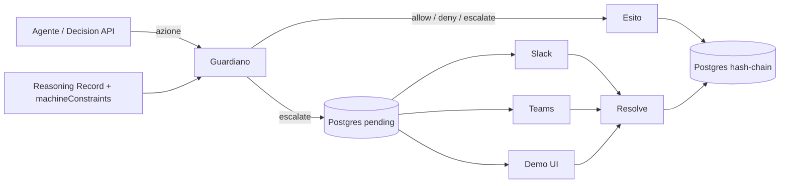

# Guardiano runtime — limiti machine-readable

> Complemento del diario umano: le schede restano leggibili da persone; una sezione **per le macchine** vincola gli agenti in runtime.

## Flusso



## Verdetti

| Verdetto | Significato |
|----------|-------------|
| `allow` | Consentito |
| `deny` | Bloccato |
| `escalate` | Serve una persona |

Priorità: **deny > escalate > allow**. Default se nulla matcha: `escalate`.

## Persistenza

Tabelle Prisma:

- `guardian_ledger` — append-only, `seq` univoco, hash SHA-256 a catena
- `guardian_pending` — escalate aperti/risolti

Migrazione: `prisma/migrations/20260924090000_guardian_ledger_pending/` (+ fix timestamp ISO).

L’hash usa JSON con chiavi ordinate (JSONB Postgres non deve rompere la catena).

Reset demo (`DELETE /api/guardian/ledger`): consentito fuori produzione, oppure con `GUARDIAN_ALLOW_RESET=true`.

## Pack (multi-community)

| Pack | Community `?c=` | Escalate verso | Demo |
|------|-----------------|----------------|------|
| `ai-governance` | `ai-governance` | una persona (Legal/Risk) | CV pubblici, fidi auto-score |
| `ai-ethics` | `ai-ethics` | Ethics Board | emotion AI, scrape forum, HITL |

API e demo accettano `pack` (slug community). Default: `ai-governance`.

```http
POST /api/v1/guardian/check
{ "action": "support.biometrics.emotion_score", "pack": "ai-ethics" }
```

Demo: [`/guardian?c=ai-ethics`](/guardian?c=ai-ethics) · [`/guardian?c=ai-governance`](/guardian?c=ai-governance)

## Decision API (agenti)

```bash
GUARDIAN_API_KEY="sk-..."   # oppure GUARDIAN_API_KEYS=k1,k2
```

```http
POST /api/v1/guardian/check
Authorization: Bearer sk-...
Content-Type: application/json

{
  "action": "llm.public.complete",
  "resource": "candidate.cv",
  "agentId": "hr-bot-1",
  "context": { "tool": "chatgpt" },
  "notify": true
}
```

Risposta: `verdict`, `decision`, `entry` (id/seq/hash), `pending` se escalate.

```http
GET /api/v1/guardian/check?limit=50
Authorization: Bearer sk-...
```

→ coda del ledger + `integrity`.

La demo UI (`/api/guardian/decide`) resta senza API key per il pitch.

## Escalate → persona

### Slack

```bash
SLACK_BOT_TOKEN=xoxb-...
SLACK_SIGNING_SECRET=...
SLACK_CHANNEL_ID=C...
```

Interactivity Request URL: `https://<host>/api/guardian/slack/interactions`

### Teams

```bash
TEAMS_WEBHOOK_URL=https://outlook.office.com/webhook/...
```

Adaptive Card con link firmati su `/api/guardian/resolve`.

Opzionale: `GUARDIAN_RESOLVE_SECRET` (default `AUTH_SECRET`).

## Endpoint

| Path | Auth | Uso |
|------|------|-----|
| `POST /api/v1/guardian/check` | API key | Decision API agenti |
| `GET /api/v1/guardian/check` | API key | Ledger tail |
| `POST /api/guardian/decide` | — | Demo |
| `POST /api/guardian/resolve` | — / token | Chiude pending |
| `GET /api/guardian/resolve` | token | Link Teams |
| `POST /api/guardian/slack/interactions` | firma Slack | Pulsanti |
| `GET /api/guardian/pending` | — | Pending + canali |
| `GET/DELETE /api/guardian/ledger` | — | Registro / reset demo |

## Demo

1. `npm run db:migrate` (tabelle guardiano)
2. Apri `/guardian?c=ai-governance`
3. Esegui scenari; su escalate Approva/Rifiuta (o Slack/Teams)

## Cosa non è (ancora)

- Revisore esterno firmato (Dubitor come terzo)
- Vincoli da schede curator (oltre ai seed pack)
- Rate limit Decision API

## Prossimi passi

1. Revisore esterno firmato
2. Constraints da record curator / community store
3. Rate limit + audit per API key
